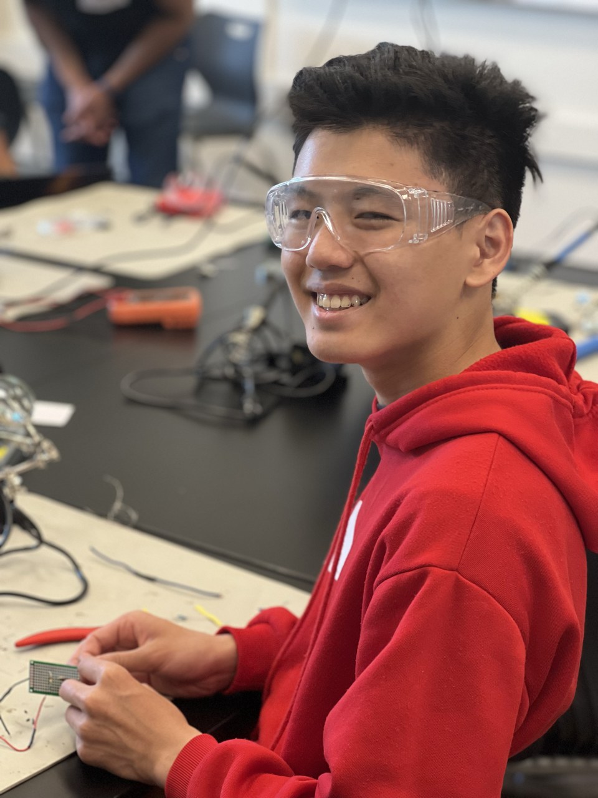
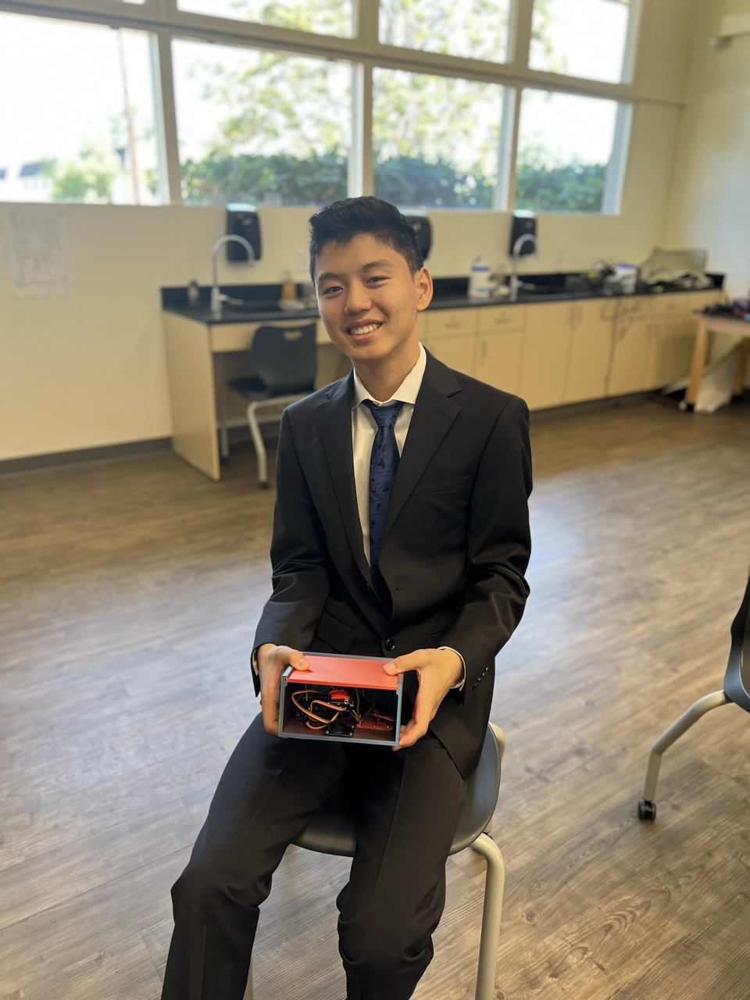
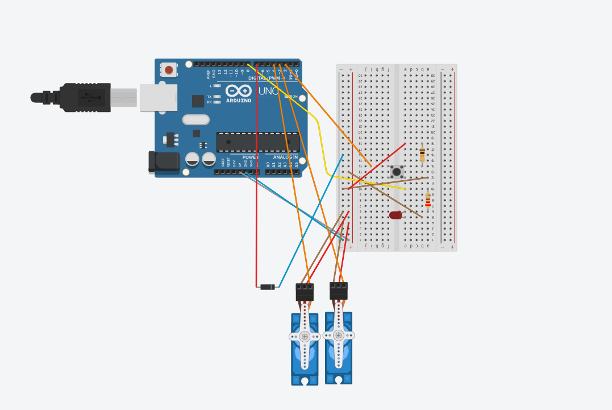

# Automated Cat Laser
<!---
Replace this text with a brief description (2-3 sentences) of your project. This description should draw the reader in and make them interested in what you've built. You can include what the biggest challenges, takeaways, and triumphs from completing the project were. As you complete your portfolio, remember your audience is less familiar than you are with all that your project entails!
-->

| **Engineer** | **School** | **Area of Interest** | **Grade** |
|:--:|:--:|:--:|:--:|
| David D | Homestead High School | Electrical Engineering | Incoming Senior

<!---
**Replace the BlueStamp logo below with an image of yourself and your completed project. Follow the guide [here](https://tomcam.github.io/least-github-pages/adding-images-github-pages-site.html) if you need help.**
-->
 

# Final Milestone

<!---
For your final milestone, explain the outcome of your project. Key details to include are:
- What you've accomplished since your previous milestone
- What your biggest challenges and triumphs were at BSE
- A summary of key topics you learned about
- What you hope to learn in the future after everything you've learned at BSE

**Don't forget to replace the text below with the embedding for your milestone video. Go to Youtube, click Share -> Embed, and copy and paste the code to replace what's below.**

<iframe width="560" height="315" src="https://www.youtube.com/embed/F7M7imOVGug" title="YouTube video player" frameborder="0" allow="accelerometer; autoplay; clipboard-write; encrypted-media; gyroscope; picture-in-picture; web-share" allowfullscreen></iframe>

-->
<iframe width="560" height="315" src="https://www.youtube.com/embed/bFjL2IWGDK0" title="YouTube video player" frameborder="0" allow="accelerometer; autoplay; clipboard-write; encrypted-media; gyroscope; picture-in-picture; web-share" allowfullscreen></iframe>

## Project Summary
In my third and final milestone, I implemented machine learning to detect if a cat is in a camera. I also implemented a button that toggles between an off and on state once the button is pressed. Once the camera detects a cat or the added button is pressed ON, the connected arduino board begins movement. I switched the breadboard out for a perfboard, so that the whole design could not only take up less space, but the wires could be soldered on, reducing the chances of a jumper wire disconnecting. I attached an LED to the perfboard, as well, so that the status of the button could be more easily indicated. I switched the wooden board with a full CAD box, and screwed all of the components onto the new box.

## Parts Used
- Implemented a machine learning program called YOLO v5 (You Only Look Once). It takes a large amount of images of different objects, and uses those images to learn the features of said objects. The machine learning program then tries to detect objects in a live video, and highlights the object in a box, along with displaying the percent certainty the program has with a detected object. Multiple aspects of the program can be changed, such as what percent certainty is required, or what images the program uses to learn.
- A perfboard replaced the breadboard, and the wires connected to the breadboard had to be cut, stripped, and soldered onto the perfboard. I made this switch, because the perfboard was much smaller compared to the breadboard, and the perfboard has places for screws to go in, while the breadboard does not.
- A button was soldered onto the perfboard. The button is a hold-down button, meaning it returns true if the button is held down. I programmed the button to make it a toggle button, meaning it returns true if the button is simply pressed.
- An LED was soldered onto the perfboard, as well. It acts as an indicator for if the button is in the on state or off state. When the button is in the on state, the LED turns on.
- Used CAD to create a box for the components to be held in. The box would hide the messy wiring, and would make the project look generally nicer.

## Challenges
- Establishing communication between YOLO v5 and the Arduino Uno board was extremely difficult. This is because YOLO v5 is in Python, while the Arduino board is in C++. I had to go into the detection code and create a method that encoded specific information into string format, so that it could send it to the Arduino board in a way that the board could understand it if a cat was detected by YOLO v5.
- I found that the micro servos I used would very easily break. The wires inside the servo motors would break off of the board if too much tension was applied to the wires. I had to open up the micro servo and re-solder the wire back onto the board, which took a lot of time.
- Re-programming the button from a hold-down button to a toggle button proved to be very difficult.

# Second Milestone
<!---
For your second milestone, explain what you've worked on since your previous milestone. You can highlight:
- Technical details of what you've accomplished and how they contribute to the final goal
- What has been surprising about the project so far
- Previous challenges you faced that you overcame
- What needs to be completed before your final milestone 

**Don't forget to replace the text below with the embedding for your milestone video. Go to Youtube, click Share -> Embed, and copy and paste the code to replace what's below.**

-->

<iframe width="560" height="315" src="https://www.youtube.com/embed/vxVb9N34CkU" title="YouTube video player" frameborder="0" allow="accelerometer; autoplay; clipboard-write; encrypted-media; gyroscope; picture-in-picture; web-share" allowfullscreen></iframe>

## Project Summary
In my second milestone, I installed a laser diode to the double-servo arm device, and programmed the laser to turn off and off while the servos were rotating. Additionally, I altered the code for the servos to make a consistent and streamlined movement instead of erratics jumps every second. This involved the use of "while" statements to constantly run a command that turns the servos little by little. I also added a wooden board and drilled holes into it so that I could screw in the arduino uno board and the double-servo arm.

## Parts Used
- A 5V laser diode was taped onto the servo arm. There are two wires on a 5V laser diode: the red wire acts as both the control and power wire, and the blue wire acts as the ground wire, and goes into the negative side of the breadboard.
- Two male-to-female jumper wires were soldered to the laser diode's wires, so that the laser diode could actually be connected to the breadboard and the digital pins in the arduino uno board.
- An 8 in. by 8 in. wooden board was cut and holes were drilled in so that the Arduino Uno board and the servo arm could be screwed in and stay stationary while the program is being run.

## Challenges
- Laser diodes work in a much different way, and required further reading of documentation to fully understand how to activate and de-activate the laser diode I installed. The laser had two wires instead the three wires I was accustomed to from LEDs and servo motors. It turns out that the laser diode's red wire acts as both the power and control wire. Additionally, laser diodes require a completely different set of methods to turn themselves on and off.

## Next Steps
- I plan to replace the breadboard with a circuit board where I solder on the jumper wires. This will allow the wires to stay on the board without the risk of falling out.
- I will add a button to the Automated Cat Laser, so I can choose whether or not the program runs.
- I can also add an ultra-sonic sensor or a camera to detect if there's movement or if there's a cat within frame, so the Automated Cat Laser can turn itself on by itself.

# First Milestone

<iframe width="560" height="315" src="https://www.youtube.com/embed/KUVGFRCeZjM" title="YouTube video player" frameborder="0" allow="accelerometer; autoplay; clipboard-write; encrypted-media; gyroscope; picture-in-picture; web-share" allowfullscreen></iframe>

## Project Summary
My project is the Automated Cat Laser. In the first milestone, I built the device that allows two micro servos to rotate it, effectively creating an arm for the laser to be installed on. I connected all of the motors to the Arduino Uno board and the breadboard.

## Parts Used
- There are two micro servos in the device, both of which can rotate up to 180 degrees, and have three wires, that being a power, control, and ground wire.
- The Arduino Uno board connects with the motors' control wire, and allows the program to manipulate the motors.
- The breadboard allows the connection of multiple motors to the arduino board. There is a positive and negative row on the breadboard, and the ground wires from the motors go to the negative side of the breadboard, and the power wires from the motors go to the positive side of the breadboard. It also connects to the Arduino Uno board to allow power to be transferred to the servos.

## Challenges
- The servo horn that is supposed to go into the base of the servo device was too large, and it required me to file the servo horn down to the correct size, so that it could fit inside of the mold in the device's base.
- It was difficult to figure out where each of the wires from the servos went. I had to scan through multiple servo documentations to figure out and understand why each wire went to their respective areas in the arduino board and breadboard.

## Next Steps
- I will add the laser diode to the servo device and the arduino board, and program it to turn on.
- I will also refine the code for the servos, so that the servos move in a consistent pattern, rather than choppy moves in one-second intervals.

# Starter Project

<iframe width="560" height="315" src="https://www.youtube.com/embed/-w8U305zvZM" title="YouTube video player" frameborder="0" allow="accelerometer; autoplay; clipboard-write; encrypted-media; gyroscope; picture-in-picture; web-share" allowfullscreen></iframe>

## Project Summary
My starter project is the Useless Box. The Useless Box consists of a lever installed on the motherboard, which when turned on, activates a rotating servo. The servo has an arm attached to it, and when the servo is activated, the arm inside the Useless Box will rotate to the lever, turning the Useless Box off, which will return the arm that turned off the machine to the original position.

The Useless Box consists of the following parts:
- The motherboard, which connects all of the parts together
- A switch
- A servo that rotates around 90 degrees when the switch is activated
- A plastic arm that is attached to the servo, which, when the lever is switched, rotates to turn off the lever.
- A small LED light that turns green when the switch is on, and red when the switch is off
- A battery holder to power the Useless Box
- Resistors which limit the power used on specific parts, such as the LED
- Screw terminals to allow wires to connect from the battery to the board

## Challenges
One challenge I faced with the project was when the arm attached to the servo missed the lever, and rendered the box *actually* useless. I had to re-adjust the servo and the arm to make sure it hit the lever when the lever was flipped. Another issue I faced was the soldering. I had to hold each piece in the correct orientation when soldering, and I consistently burned myself during the first few tries. I was eventually able to learn some tips and tricks, and finished soldering the rest of the parts without burning myself.

After the starter project, I will work on my intensive project, which is the Automated Cat Laser.

# Schematics 



# Code
Here's where you'll put your code. The syntax below places it into a block of code. Follow the guide [here]([url](https://www.markdownguide.org/extended-syntax/)) to learn how to customize it to your project needs. 

```c++
#include <Servo.h> 
int servoPinBase = 3; 
int servoPinRotate = 4;
Servo servoBase, servoRotate;
int data;

int baseAngle = 0;
int rotateAngle = 0;
int buttonState = 0;
bool firstPressState = false;
bool secondPressState = false;
bool beginning = true;
bool buttonIsPressed = false;

void setup() { 
   servoBase.attach(servoPinBase);
   servoRotate.attach(servoPinRotate);
   servoBase.write(90);
   servoRotate.write(0);
   pinMode(7, OUTPUT); //Laser
   pinMode(2, INPUT); //Button
   pinMode(8, OUTPUT); //LED Indicator
   Serial.begin(9600);
}

void buttonTest(){
  buttonState = digitalRead(2);
  if (buttonState == HIGH && beginning == true && firstPressState == false && secondPressState == false){
    firstPressState = true;
    beginning = false;
    digitalWrite(8, HIGH);
    buttonIsPressed = true;
  }
  if (buttonState == LOW && firstPressState == true && beginning == false && secondPressState == false){
    firstPressState = false;
    secondPressState = true;
  }
  if (buttonState == HIGH && secondPressState == true && firstPressState == false && beginning == false){
    digitalWrite(8, LOW);
    secondPressState = false;
    buttonIsPressed = false;
  }
  if (buttonState == LOW && secondPressState == false && beginning == false && firstPressState == false){
    beginning = true;
  }
}

void loop() {
  while (Serial.available()){
      data = Serial.read();
  }

  buttonTest();

  if (data == '1' || buttonIsPressed == true){
    digitalWrite(7,HIGH);
    baseAngle = random(45,135);
    rotateAngle = random(0,70);
    servoBase.write(baseAngle);
    servoRotate.write(rotateAngle);
    for (int a = 0; a < 25; a++){
      delay(20);
      buttonTest();
    }
  }
  else{
    digitalWrite(7,LOW);
    delay(20);
  }
}
```

# Bill of Materials
Here's where you'll list the parts in your project. To add more rows, just copy and paste the example rows below.
Don't forget to place the link of where to buy each component inside the quotation marks in the corresponding row after href =. Follow the guide [here]([url](https://www.markdownguide.org/extended-syntax/)) to learn how to customize this to your project needs. 

| **Part** | **Note** | **Price** | **Link** |
|:--:|:--:|:--:|:--:|
| Arduino Uno Board | The master board that controls all of the hardware, such as the servos and lasers. | $28.50 | <a href="https://www.amazon.com/Arduino-A000066-ARDUINO-UNO-R3/dp/B008GRTSV6/"> Link </a> |
|:--:|:--:|:--:|:--:|
| Solderable Perfboard | What the item is used for | $9.99 | <a href="https://www.amazon.com/ElectroCookie-Solderable-Breadboard-Electronics-Gold-Plated/dp/B081MSKJJX/"> Link </a> |
|:--:|:--:|:--:|:--:|
| Micro Servo 9g x2 | Servos that rotate up to 180 degrees and act as the joints for the arm that rotates the laser diode. | $7.29 | <a href="https://www.amazon.com/Sipytoph-Helicopter-Airplane-Walking-Control/dp/B09185SC1W/"> Link </a> |
|:--:|:--:|:--:|:--:|
| Tactile Switch Button | A hold-down button I programmed to be a toggle button. I only used one. | $11.99 | <a href="https://www.amazon.com/Tactile-Button-Horizontal-Momentary-12x12x12mm/dp/B0BLZNJ9DW/"> Link </a> |
|:--:|:--:|:--:|:--:|
| 3V Red LED | An indicator for the status of the button. I only used one LED. | $Price | <a href="https://www.amazon.com/MCIGICM-Circuit-Assorted-Science-Experiment/dp/B07PG84V17/"> Link </a> |
|:--:|:--:|:--:|:--:|
| Resistors | Limiting voltage on the button and LED, preventing shorts. I only used a 220Ω resistor and 10kΩ resistor for the LED and button, respectively. | $10.99 | <a href="https://www.amazon.com/BOJACK-Values-Resistor-Resistors-Assortment/dp/B08FD1XVL6/"> Link </a> |
|:--:|:--:|:--:|:--:|
| 5V Laser Diode | Shoots a laser when the button is pressed or when the object detection program picks up a cat. | $6.79 | <a href="https://www.amazon.com/HiLetgo-10pcs-650nm-Diode-Laser/dp/B071FT9HSV/"> Link </a> |
|:--:|:--:|:--:|:--:|
| Jumper Wires | Making connections between the Arduino Uno board and other hardware, such as servo motors. | $7.99 | <a href="https://www.amazon.com/EDGELEC-Breadboard-Optional-Assorted-Multicolored/dp/B07GD2BWPY/"> Link </a> |
|:--:|:--:|:--:|:--:|
| Regular Copper Wires | Making small connections within the perfboard | $14.99 | <a href="https://www.amazon.com/TUOFENG-Hookup-Wires-6-Different-Colored/dp/B07TX6BX47"> Link </a> |
|:--:|:--:|:--:|:--:|
| OnShape | Website used to design the box that holds all the components. | N/A | <a href="onshape.com"> Link </a> |
|:--:|:--:|:--:|:--:|
